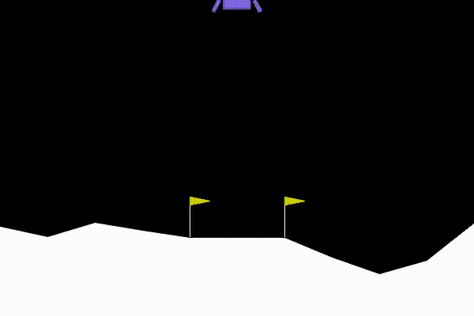
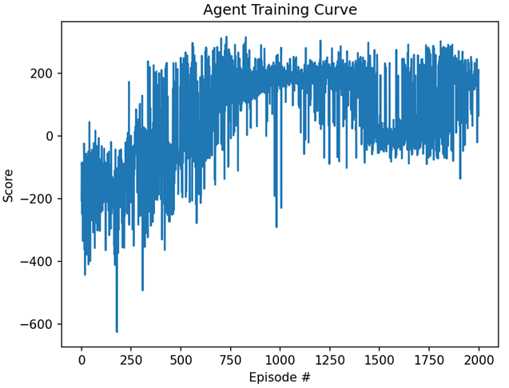

# Deep Q-Network (DQN) Lunar Lander


An implementation of a Deep Q-Network (DQN) from scratch in PyTorch to solve the Gymnasium `LunarLander-v3` environment. 

### The Best Agent in Action



## Project Overview
The goal of this project is to train an RL agent, which controls 3 engines, to navigate a lander to a landing pad.

This project implements the DQN algorithm using Pytorch, and on future version will explore more advanced methods for this task.

## Technical Implementation
* **Framework:** PyTorch
* **Architecture:**
  * 2 Fully Connected Linear Layers (State Space: 8 -> 64 -> Action Space: 4)
  * ReLU Activation functions
* **Action Selection:** $\epsilon$-greedy policy with decay.
* **Optimization:** Mean Squared Error (MSE) Loss with Adam Optimizer.

### Key RL Features Included:
1. **Experience Replay Buffer:** Breaks the correlation of sequential observations by randomly sampling past experiences (State, Action, Reward, Next State) to train the network.
2. **Fixed Q-Targets:** Utilizes a "Local" network for active playing/learning and a frozen "Target" network for calculating the expected future rewards. This prevents the moving target problem and stabilizes training.

### Simulation details:
**Rewards** are defined by the environment:
* Moving closer to the landing pad: Positive points (up to ~140 points).
* Crashing: -100 points.
* Coming to rest safely: +100 points.
* Each leg touching the ground: +10 points.
* Firing the Main Engine: -0.3 points per frame.
* Firing the Side Engines: -0.03 points per frame.  

**Agent input**:
1. X Position: The horizontal coordinate of the lander (0 is the center of the screen).
2. Y Position: The vertical coordinate (height above the ground).
3. X Velocity: How fast it is moving horizontally (drifting left or right).
4. Y Velocity: How fast it is falling or rising.
5. Angle: The tilt of the spaceship (is it completely upright, or leaning 45 degrees?).
6. Angular Velocity: How fast the ship is spinning or tumbling.
7. Left Leg Contact: A boolean value (1.0 if the left leg is touching the ground, 0.0 if not).
8. Right Leg Contact: A boolean value (1.0 if the right leg is touching the ground, 0.0 if not).

**Action space**:
* 0: do nothing
* 1: fire left orientation engine
* 2: fire main engine
* 3: fire right orientation engine

## Training Results & Analysis
The environment is considered "solved" when the agent achieves an average score of **200+ over 100 consecutive episodes**. 

an example of score (total reward) vs. episode:



## Discussions

Discussions for each major update should be in the discussion folder.


## How to Run This Project

**1. Clone the repository and install using the requirement.txt file:**

**2. Watch the trained agent play:**
```
python video_recorder.py
```

**3. Train a new agent:**
```
python train.py
```
