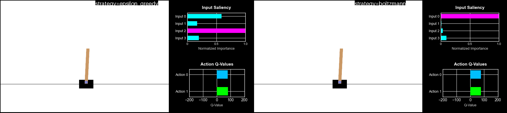
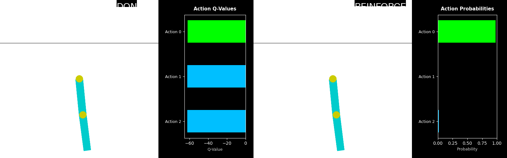
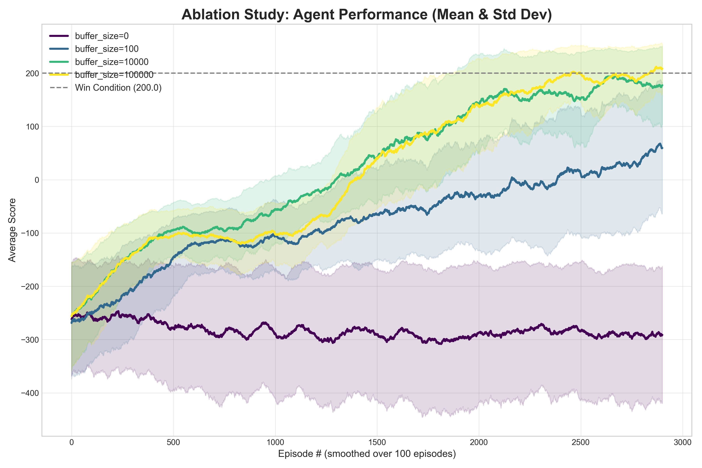
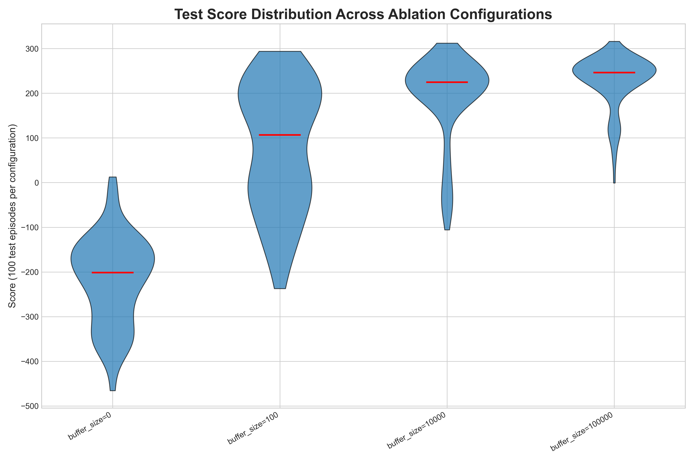

# Deep Q-Network (DQN) Lunar Lander


An implementation of a Deep Q-Network (DQN) from scratch in PyTorch to solve the Gymnasium environments. 
## Some examples of ablation studies done here:
### PER effect:

### Replay Buffer Length Effect (with wind and turbulence):
.gif)
### Exploration methods:

### DQN beats REINFORCE:


## Project Overview
The goal of this project is to learn how to train an RL agent.

This project implements the DQN algorithm using Pytorch, and on future version I will explore more advanced methods for this task.

It includes a thorough ablation study to study the effect of the concepts implemented here.

## Technical Implementation
* **Framework:** PyTorch
* **Action Selection:** $\epsilon$-greedy or Boltzmann exploration, with decay schedules.
* **Optimization:** Mean Squared Error (MSE) Loss with Adam Optimizer.

## Algorithms & Concepts Implemented

* **Deep Q-Network (DQN):** A foundational value-based algorithm that uses a neural network to approximate Q-values, learning the expected future rewards for each action in a given state.
  * **Experience Replay Buffer:** Stores past experiences (state, action, reward, next state) and samples them randomly during training to break the correlation between sequential observations.
  * **Target Network:** Utilizes a separate, slowly-updating "Target" network to calculate expected target Q-values, preventing the moving target problem and stabilizing training.
  * **Double DQN (DDQN):** An improvement over standard DQN that separates action selection (using the local network) from action evaluation (using the target network) to mitigate the overestimation of Q-values.
  * **Dueling DQN:** Modifies the network architecture to estimate the state value and the advantages of each action separately before combining them. This helps the agent learn which states are inherently valuable independent of the action taken.
  * **Prioritized Experience Replay (PER):** Enhances the standard replay buffer by sampling experiences with a higher Temporal Difference (TD) error more frequently, focusing the agent's learning on the most informative transitions.
* **REINFORCE:** A classic policy gradient algorithm that directly optimizes the agent's policy by using the total episode return to scale the gradients of the log probabilities of the actions taken.
* **Advantage Actor-Critic (A2C):** A hybrid architecture featuring an "Actor" that determines the policy and a "Critic" that evaluates actions by estimating state values.
  * **n-step Returns:** Instead of looking just one step ahead, the critic evaluates returns over `n` consecutive steps to balance bias and variance in value estimation.
  * **Generalized Advantage Estimation (GAE):** An advanced technique for computing action advantages that uses an exponentially weighted average of n-step returns to smoothly trade off between bias and variance, leading to more stable policy updates.
  * **Orthogonal Initialization:** A weight initialization scheme that helps prevent exploding or vanishing gradients by preserving the variance of activations across layers, leading to more stable training.
  * **Gradient Clipping:** A technique to prevent exploding gradients by scaling down gradients if their norm exceeds a predefined threshold, ensuring more stable weight updates during optimization.
  * **Vectorized Environments:** Uses multiple environments in parallel to collect batched, uncorrelated experiences simultaneously, heavily speeding up convergence.
  * **Shared Backbone Architecture:** An optional configuration where the Actor and Critic share initial layers to improve feature extraction and sample efficiency.
  * **TD(λ) Returns:** An efficient integration that computes Critic targets directly from GAE advantages, providing robust value estimations.

## Training Results & Analysis
 
Examples of lunar lander agent:

an example of score (total reward) vs. episode:


and the testing performance:


## Discussions

Discussions for each major update should be in the discussion folder.

## Version history:
* 1.0.0 - standard DQN

   > Replay Buffer\
  Target Network

* 1.1.0 - QoL

  > Easier network modifications

* 1.2.0 - DDQN & config

  > Double DQN

  > Configuration file

* 1.2.1 - Experiments

  > Experiments script

* 1.2.7 - Ablation Study

  > Ablation study

  > Better seed management  

  > tau and lr schedulers

  > Automated GIF generation

* 1.3.0 - More environments

  > Added support for multiple environments
  
* 1.3.1 - More environments

  > Added support for `CartPole-v1`, `MountainCar-v0`, `Pendulum-v1`, and `BipedalWalker-v3`.

* 1.3.2 - Dueling DQN

  > Implemented Dueling DQN architecture.

  > Added "fake actions" experiment

* 1.4.0 - Prioritized Experience Replay (PER)

  > Implemented Prioritized Experience Replay (PER) for more efficient learning.

* 1.4.1 - Added Boltzmann exploration

  > Now we can choose between epsilon-greedy and Boltzmann exploration.

* 1.5.0 - Added REINFORCE

  > Added REINFORCE algorithm

* 1.5.2 - Added A2C with GAE

  > Added A2C algorithm with n-step returns and Generalized Advantage Estimation (GAE).

## How to Run This Project

**1. Clone the repository and install using the requirement.txt file:**

**2. Change config file as needed:**

Open `config.yaml` and set the `active_env` to the desired environment (e.g., `"LunarLander-v3"`, `"Acrobot-v1"`, `"CartPole-v1"`, etc.).

You can also configure the `ablation_study` section to choose the type of study:
* `study_type: 'component'`: The original buffer/target network ablation.
* `study_type: 'sweep'`: Sweep over a single hyperparameter.
* `study_type: 'dqn_variants'`: Compare DQN without Taget Network, DQN with Target Network , and Double DQN.

**3. Run ablation study:** runs the ablation, test the results, and generate gifs. 
```
python ablation_study.py
```
