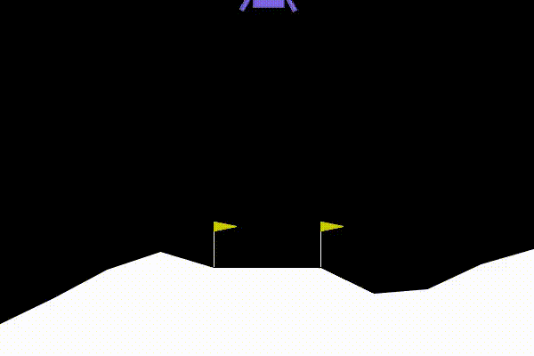

# Version 1.0.0 discussion

## Version features
This is the **Vanilla DQN**.

This version include:

* 3 Fully Connected Linear Layers (State Space: 8 -> 64 -> Action Space: 4)
* ReLU Activation functions
* $\epsilon$-greedy policy with decay.
* Mean Squared Error (MSE) Loss with Adam Optimizer.
* Experience Replay Buffer
* Fixed Q-Targets (Local+Target Networks)
* Rewards are defined by the environment

## Results:

* best landing recorded:

* It does manage to learn how to land the ship but the training proccess is pretty noisy.

* I did encountered something some may call the "Catastrophic Forgetting" problem: 

We may forget past experience prematurly. I will try to address it in the future

* I do see interesting behavior even early on, for example, I see the following on episode 500:

## Future ideas:

* experiment with NN architecture, add hidden layers, test 'bottleneck' architectures.
* play with replay buffer length to see if it helps with the catastrophic forgetting problem.
* implement double DQN.