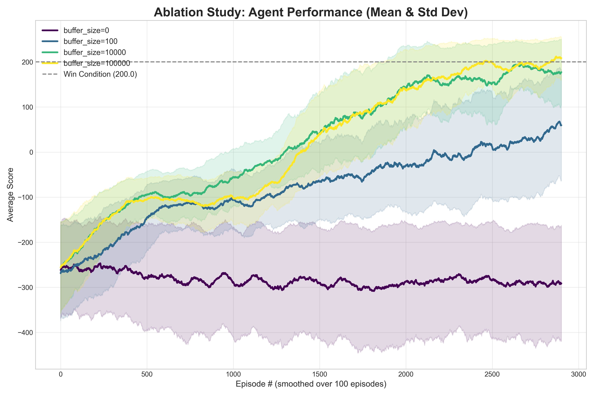
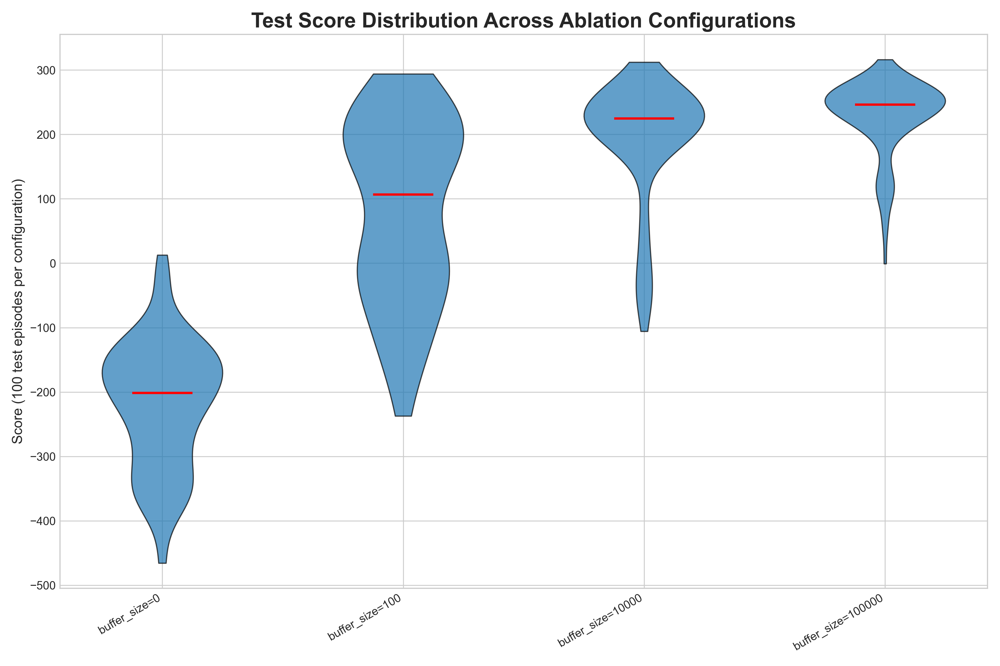

# Version 1.2.0 discussion

## Version features
**changes**:

* Added ablation study.
* Fixed seed issue
* Automated gif generation
* Schedulers - for tau and lr
* QoL improvement - folder reordered

**This version include:**

* Double DQN scheme
* Ablation study

## Results:

* Ablation study results for experience replay size:
.gif)

* Score 

and its test scores distribution:

## Future ideas:

* Add a target network ablation study
* Add another environment: maybe Acrobot 