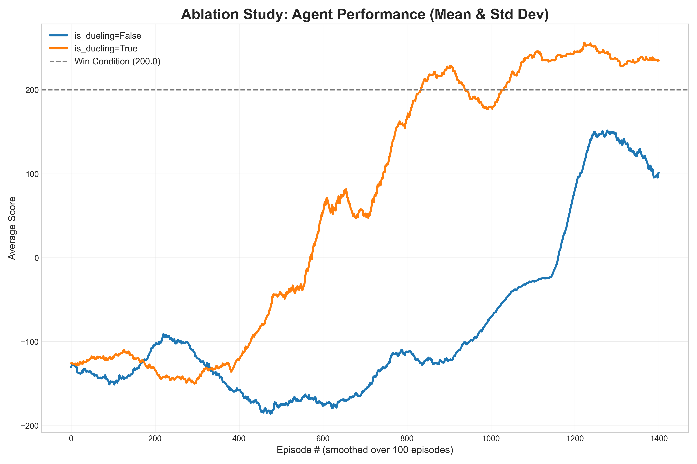
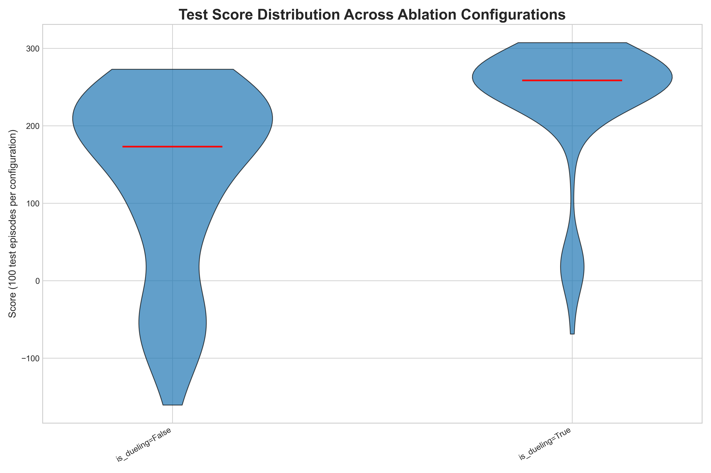
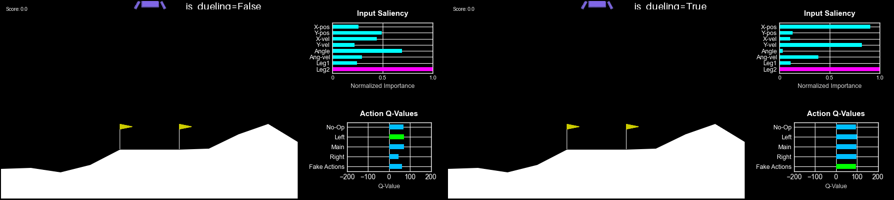
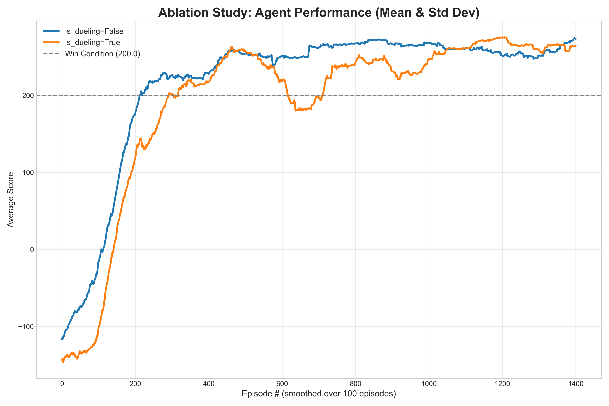

# Version 1.3.2 Discussion - Dueling DQN

## Version Features
**Changes:**
*   Implemented the Dueling DQN architecture.
*   Added a "fake actions" experiment to demonstrate the advantage of Dueling DQN in noisy action spaces.
*   Generalized the experiment framework to support fake actions in other environments like `MountainCar-v0`.

**This version includes:**
*   Dueling DQN architecture option (`agent.is_dueling`).
*   An ablation study comparing Dueling DDQN vs. standard DDQN.

## Dueling DQN Architecture

In many reinforcement learning scenarios, the value of a state is not strongly tied to the specific action taken within it. To better model this, the Dueling DQN architecture splits the Q-value function into two separate streams:

1.  **Value Stream (`V(s)`):** A scalar value that estimates how good it is to be in a given state `s`.
2.  **Advantage Stream (`A(s, a)`):** A vector that estimates the advantage of taking each action `a` relative to the other actions in that state.

These streams are then combined to form the final Q-value estimation. To solve the "identifiability problem" and ensure a stable decomposition of Q into V and A, the advantage stream is centered by subtracting the mean advantage, as proposed by Wang et al. (2016) in "Dueling Network Architectures for Deep Reinforcement Learning".

The final combination is:
`Q(s, a) = V(s) + (A(s, a) - mean(A(s, a')))`

This formulation allows the network to learn the state-value function `V(s)` without having to learn the effect of every action for every state, leading to better sample efficiency in environments with large or redundant action spaces.

## The Experiment: Redundant "Dummy Actions"

To highlight the strength of this architecture, an ablation study was conducted in the `LunarLander-v3` environment. The action space was artificially expanded by adding 16 "dummy actions", all of which map to the real "do nothing" action. This increases the agent's action space from 4 to 20.

This setup creates a challenging scenario where a standard DDQN must learn the Q-value for 17 identical "do nothing" actions independently, which is highly inefficient. In contrast, a Dueling DQN is hypothesized to be more robust. It can learn the state's value through the `V(s)` stream and quickly determine that the advantage `A(s, a)` is the same for all the redundant "do nothing" actions.

## Results

The results from the ablation study clearly demonstrate this effect.

### Training Performance

The Dueling DDQN (`is_dueling=true`) learns significantly faster and reaches a higher, more stable average score compared to the standard DDQN (`is_dueling=false`).

### Testing Performance

The superior performance is confirmed in testing. The Dueling agent achieves a higher median score and a more consistent (less spread-out) performance distribution across 100 test episodes.

### Agent Behavior

The resulting agent behavior can be seen in the comparison GIF.

### Counterpoint: Performance in Simple Environments

It is worth noting that in a separate experiment on the standard environment (with no dummy actions), the standard DDQN converged slightly faster. This suggests that for simpler tasks with a clean, small action space, the extra complexity of the Dueling head can be a minor hindrance and is not always necessary.

## Future Ideas
*   Implement and combine with Prioritized Experience Replay (PER), which is known to synergize well with Dueling DQN.
*   Conduct a more extensive sweep on the number of dummy actions to see how it affects the performance gap between the two architectures.