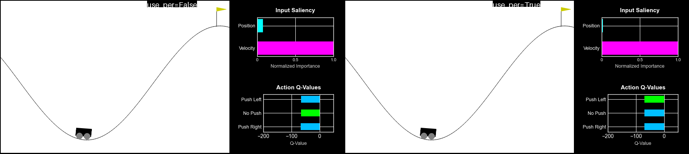
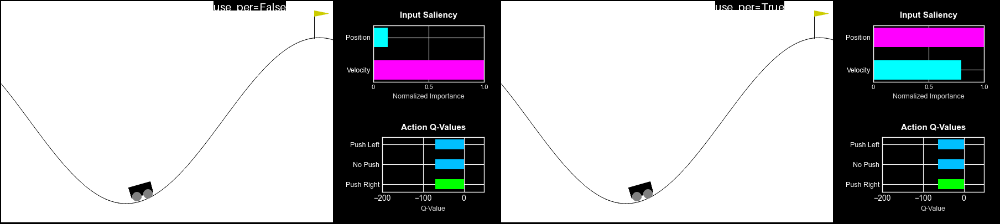
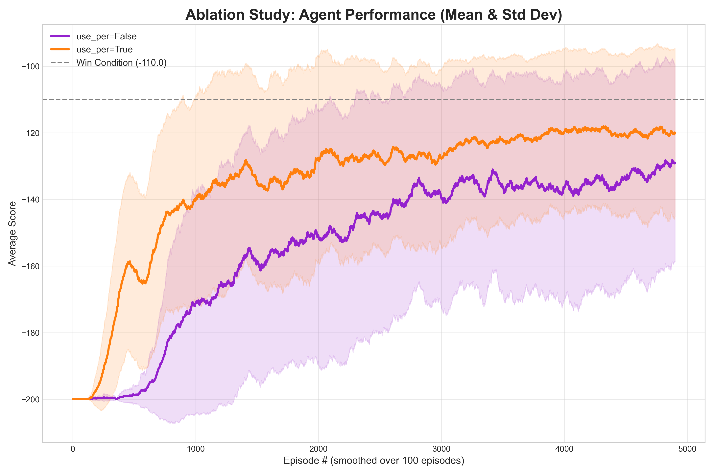
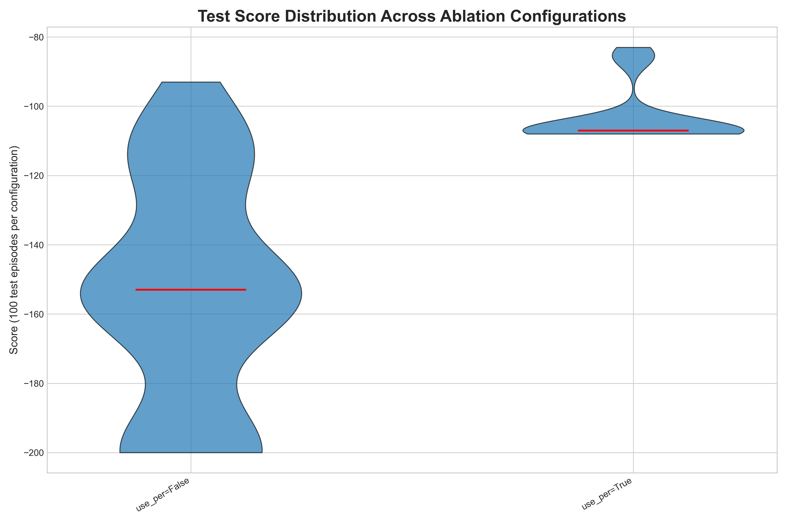

# Version 1.4.0 Discussion - Prioritized Experience Replay (PER)

## Version Features
**Changes:**
*   Implemented Prioritized Experience Replay (PER) as an optional component for the agent.
*   Integrated `torchrl.data.PrioritizedReplayBuffer` for efficient PER implementation.
*   Added configuration options for PER parameters (`per_alpha`, `per_beta_start`, `per_beta_end`, `per_beta_frames`).

**This version includes:**
*   An ablation study option to compare agents with and without PER.
*   PER can be combined with other DQN variants (DQN, DDQN, Dueling DDQN).

## Prioritized Experience Replay (PER) Theory

In standard Deep Q-Networks (DQN), experiences are sampled uniformly from the replay buffer. This means every transition `(s, a, r, s', done)` has an equal chance of being revisited. However, not all experiences are equally important for learning. Some transitions might be more "surprising" or contain more valuable information (e.g., a rare reward, a critical state transition where the agent made a significant mistake). Prioritized Experience Replay (PER) addresses this by sampling transitions with higher priority, typically based on their Temporal Difference (TD) error.

### How PER Works:

1.  **Prioritization based on TD Error:**
    *   When a new experience `(s, a, r, s', done)` is added to the replay buffer, it's assigned an initial priority. A common practice is to assign it the maximum priority observed so far, or a default high value (e.g., 1.0), to ensure it gets sampled at least once.
    *   After a batch of experiences is sampled and the agent learns from them, the TD error for each sampled experience is calculated: `TD_error = Q_target - Q_expected`.
    *   The absolute value of this TD error (`|TD_error|`) is used as the new priority for that experience in the buffer. A higher TD error means the agent was more "surprised" by this transition, indicating it's more important to learn from.

2.  **Sampling Probability:**
    *   Experiences are sampled from the buffer with a probability proportional to their priority. A common sampling strategy uses a power-law distribution:
        `P(i) = (priority_i^alpha) / (sum_k(priority_k^alpha))`
    *   The `alpha` parameter (typically between 0 and 1) determines how much prioritization is used. `alpha = 0` corresponds to uniform sampling, while `alpha = 1` means full prioritization.

3.  **Importance Sampling (IS) Weights:**
    *   Prioritized sampling introduces a bias because experiences with higher TD errors are sampled more frequently. To correct this bias, Importance Sampling (IS) weights are used during the Q-value update.
    *   Each sampled experience `i` is weighted by:
        `w_i = (N * P(i))^(-beta)`
    *   `N` is the buffer size.
    *   The `beta` parameter (typically annealed from `beta_start` to `beta_end` over training) controls the degree of bias correction. `beta = 0` means no correction (biased learning), while `beta = 1` means full correction. Annealing `beta` from a lower value to 1.0 helps stabilize early training while gradually reducing bias.
    *   The loss function is then modified to include these weights: `Loss = (w_i * MSE(Q_expected, Q_target)).mean()`.

## Implementation Details with `torchRL`:

This implementation leverages `torchrl.data.PrioritizedReplayBuffer` for efficient management of priorities and sampling.

*   **`Agent.__init__`**:
    *   A `use_per` flag in `config.agent` determines whether to use `PrioritizedReplayBuffer` or the standard `ReplayBuffer`.
    *   PER-specific parameters (`per_alpha`, `per_beta_start`, `per_beta_end`, `per_beta_frames`) are loaded from the config.
    *   `self.per_beta` is initialized to `per_beta_start` and `self.frame_count` is initialized to 0 for annealing.
*   **`Agent.step`**:
    *   When `use_per` is true, experiences are added to the `PrioritizedReplayBuffer` as `TensorDict` objects.
    *   `self.frame_count` is incremented, and `self.per_beta` is annealed towards `per_beta_end`.
    *   When `learn` is called, `self.memory.sample` is invoked with the current `self.per_beta`. This returns not only the experiences but also their `indices` and `importance_sampling_weights`.
*   **`Agent.learn`**:
    *   The TD error (`Q_target - Q_expected`) is calculated.
    *   If `use_per`, the `per_weights` are applied to the MSE loss: `loss = (per_weights * F.mse_loss(Q_expected, Q_targets, reduction='none')).mean()`.
    *   The `td_error` is then used to update the priorities in the `PrioritizedReplayBuffer` via `self.memory.update_priority(indices, td_error.abs().squeeze().cpu().numpy())`.
    *   The `learn` method now returns the `td_error` (along with the Q-value) when PER is active, which is then used by `step` to update priorities.

## Results

sometimes it wins by a lot:


and sometimes it's a close competition:


But it seems like the PER version often wins:

In training:


And in testing:


## Future Ideas
*   Investigate the optimal values for `per_alpha` and `per_beta` for different environments and reward structures.
*   Explore other prioritization schemes beyond absolute TD error.
*   Combine PER with Dueling DDQN in the "fake actions" experiment to see if it further enhances performance.
```